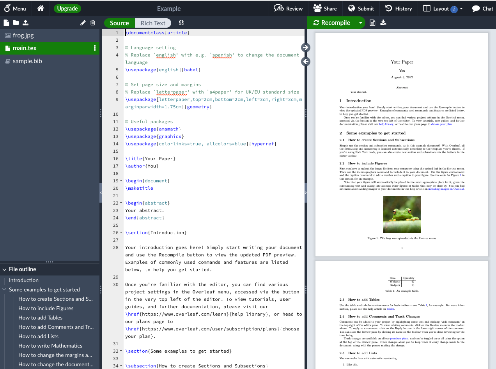

## What is LaTeX and why use it

LaTeX (pronounced *LAY-tek* or *LAH-tek*) is a tool for creating professional-looking documents, reports, books, CVs, and presentations. 

In LaTeX the document and the output are separated. This means you only focus on the contents of the document, and your computer will handle the formatting, which saves a lot of work. 

The main advantages of using LaTeX are that it is great at handling complex formatting such as mathematical formulas, table of contents, figure positions, bibliographies and more. Another advantage is once you've written the content of your document, you can change your documents appearance without any weird formatting consequences (I'm looking at you Microsoft Word). 

The obvious disadvantage is that you have to do some coding to use it, which has a learning curve! 

## Outcomes

By the end of this workshops you will: 

* Start to use Overleaf
* Create document in LaTeX that includes
  - titles
  - sections
  - images
  - lists
  - tables
  - hyper links
  - references
  - equations 

It might feel like there is a lot to explore. However, we split it into separate sections to make it easier for you to work through. We hope you enjoy it!

## Introduction to Overleaf

LaTeX has been around a while, and therefore there are lots of options available to write and make LaTeX documents. The easiest way to get started with is Overleaf (formally ShareLaTeX), which has a clear user interface and will spare you from software and package installation. Overleaf is an online interface to write LaTeX code and produce documents; the syntax used is the same as any other LaTeX editor. 

To get started you will need to [make an overleaf account](https://www.overleaf.com/register). 

<div class="figure" style="text-align: center">

<p class="caption">The environment you will see when you open a project in Overleaf. This is the 'Example Project' template. Key things to note are the top right with the main.tex and frog.jpg which are your files. Middle is your tex file where you do all your writing. Right is the output.</p>
</div>


## Useful resources to use during this session

* [Overleaf documentation](https://www.overleaf.com/learn)
* Google search what you need - e.g. *hyperlink colour latex*

### Extra resources for after the session
* Videos that [introduce various LaTeX topics](https://www.youtube.com/playlist?list=PLnC5h3PY-znyDQKn3knfXfekZLgWyL7QW)
* 30 minute [learn LaTeX course](https://www.overleaf.com/learn/latex/Learn_LaTeX_in_30_minutes)
* Free [online introduction to LaTeX](https://www.overleaf.com/learn/latex/Free_online_introduction_to_LaTeX_(part_1))

## Exercises

A friend sent you a really cool article on the gender pay gap in the UK and you want to edit it to add some of your own ideas or research. You remember that you can do this with [Adobe](https://www.adobe.com/uk/), but they are asking you to pay for the software, we can't afford that!  

You think of a creative solution...you've been meaning to learn LaTeX so how about we write the document into LaTeX so we can edit and change what we like?  

You've emailed the author to ask them about the images and if you can use their article. They respond enthusiastically giving you a link to the files that has the following resources that will help you make your document: 

* The pdf of their document called **gender\_pay_gap.pdf**
* A csv file with the output of one of their analysis called **paygap\_sector_averages.csv**
* The two images they used in their report called **pay\_gap_bot.png** and **paygap.png**
* Their references file called **references.bib**
* A LaTeX template called **LaTeX_workshop.zip**

[Click link to access the files](https://lsecloud.sharepoint.com/:f:/s/TEAM_APD-DSL-Digital-Skills-Trainers/EuB98M0onDpPrZY6cNrWkBcBhMH82p90h8keWN2u4B0FVQ?e=bAXjmK)

### Task 0 — load the template into Overleaf

1) Download all the [files](https://lsecloud.sharepoint.com/:f:/s/TEAM_APD-DSL-Digital-Skills-Trainers/EuB98M0onDpPrZY6cNrWkBcBhMH82p90h8keWN2u4B0FVQ?e=bAXjmK) to your computer
2) Unzip/extract the files you have downloaded. On a Mac you double click the file to unzip, on a Windows you right-click -> extract all
3) Open Overleaf -> New Project (Green button in the upper-left corner) -> Upload Project -> upload the **LaTeX_workshop.zip** file

Once uploaded, Overleaf will present you with a split-screen. On the left side you will see LaTeX code. On the right side you will see the result of running the code, i.e., the way you report will look like. As you can tell, it requires some work…

***

#### A side note on LaTeX document structure and syntax

Now you have the document open in Overleaf we can take a quick de-tour for a run through of the general ideas and rules of LaTeX.

##### Document structure

LaTeX documents have a two part structure. The first section is called the *preamble*, and the section section is where your document starts (look for the `\begin{document}` syntax). 

The *preamble* is the set up, where you specify:

- What you want to do in LaTeX such as writing a document, a presentation, Cv and so on. Look for the `\documentclass[11pt]{article}` syntax which tells you what you are working on
- You set up your title and references. Look in the document for anything that says bibliography and title
- What packages you will be using. Packages in LaTeX are similar to the way we use them in other programming languages like R and Python. We load in the package and then it is available for use. You can see if a package has been loaded by looking for the `\usepackage{}` syntax. How many packages are we using in our template? 

Where your document starts, after `\begin{document}`, is where all your writing, figures, tables, sections and so on will go. 

##### Syntax

The syntax of LaTeX has a few specific rules which are outlined below:

- We start commands with a backslash such as `\newpage`
- Most commands have parameters which go in curly brackets such as `\title{Joe Bloggs}`
- Arguments go in square brackets such as `\documentclass[11pt]{article}` where 11pt is the argument for the size of the text
- plain text is just plain text
- If something begins, we need to end it. To put it more philosophically *Anything that has a beginning must have an ending*
- We write comments using the percent sign
- Special characters like % need to be *escaped*, which means we ignore that characters special characteristics. This can be done with the backslash like: `25\%`

***

### Task 1 — title page

Now we have the a basic document we need to build up that title page! 

In Overleaf take a look on the left panel where the code is. Can you spot any code that would define a title, the authors, the date, and an abstract? 

Using the **gender\_pay_gap.pdf** file as your example:

* Change the title
* Replace the authors with your own name 
* change the date to todays date
* Change the abstract
* Make sure the title and abstract are on a separate page to the rest of the document.

*Hint: Looking at the command `\title{your title here}` what is the output of this code? Check the panel in the left and look at your title. How would you change the text of the title?*

### Task 2 — contents

We have the nice looking title page, which is a great start! 

Next we set up the contents page which should include a table of contents, list of figures, and list of tables. We might not have added tables or figures yet, but we will soon. 

* Use the [Overleaf documentation](https://www.overleaf.com/learn) to find out how to add a table of contents, list of figures, and list of tables to your document
* Make sure your content page is on a separate page to the rest of the document

You are very particular and notice in our document we have numbers next to our sections but the document we are copying doesn't, how annoying! You do a quick online search and find this answer in a [stack exchange thread](https://tex.stackexchange.com/a/30123) which seems to solve your problem, yay! The simplified version of this is as follows:  

```
\section*{Introduction}
\addcontentsline{toc}{section}{Introduction}
```

### Task 3 — upload documents to Overleaf

For the next tasks we will need to upload the resources the author sent us into Overleaf. Using the upload button (on the upper left hand side of Oveleaf, just under menu) add the following files to your Overleaf project:

* pay\_gap_bot.png
* paygap.png
* references.bib

Once uploaded, you’ll be able to see the files in your project (on the left to your code). Try clicking on them to view them.

Note that once you recompile your document you will get the following error: **Package natbib Warning: Empty 'thebibliography' environment on input line 3**. We will be adding our references later which will fix the issue, but if you want to solve this now add `\nocite{*}` before `\bibliography{references.bib}`. 

### Task 4 — introduction

Great, we have a title page and a contents page. We are in a good place to start adding the content to our document. 

The introduction we are copying has links and an image, exciting! 

* Copy introduction text from the pdf into Overleaf (make sure to paste in the introduction section)
* Using the Overleaf documentation:
  - Add the links. Right click on the links to get the urls
  - Add the figure, which is the `pay_gap_bot.png` image file in your project
* Make sure you've added a caption and your image is in the centre of the page

Note that to make the image the same as the example something like this will work: ` \includegraphics[width=0.7\linewidth]{pay_gap_bot} `

### Task 5 — methods

You might notice when you *Recompile* the gender pay gap bot figure now appears in your list of figures, cool!

Next up, the methods section which has more new elements in equations and citations. 

* Make a new section called methods, like we have for introduction
* Add a new page between methods and introduction
* Copy the text from the methods in the pdf into Overleaf
* Add the url links
* Write the equations
* Add the references, all of which are in the *references.bib* file

***

**Equation hint 1:** The easiest way to replicate this equation is to use *math* like: `\begin{math} your equation \end{math}`

**Equation hint 2:** LaTeX has shortcuts for common mathematics symbols like plus and divide. Plus is `\sum` and divide is `\div`. What do you think multiplication would be? 

If you added `\nocite{*}` on task 3, you can remove it now if your references are not appearing. 

**Reference hint 1:** there are two ways to cite in LaTeX using either `\cite{}` or `\citep{}`. It looks like our example has used `\citep{}`.

**Reference hint 2:** each reference in the *references.bib* file has a label which you use within the cite command like `\cite{ggtext}`. 

**Reference hint 3:** if you are interested in having numbered references you can add in `\setcitestyle{numbers}` above `\bibliographystyle{apsr}`. This [useful Stack Exchange thread](https://tex.stackexchange.com/questions/412067/how-to-add-numbering-to-reference-list-but-still-use-authoryear-in-natbib) has more information. 

***

#### General note about references

The template, rather helpfully, has been set up to handle citations and references. If you are starting off from nothing, first you'll need these two lines somewhere before `\begin{document}`: 
```
% this is for the bibliography
\usepackage[]{natbib}
\bibliographystyle{apsr}
```
And later in the document you'll need the code below which builds the reference list at the end of your document. This should go just before your `\end{document}`. 

```
% end with the bibliography
\newpage

\bibliography{references.bib}
```

### Task 6 — hyperlinks

Now when you *Recompile* you'll have a reference page, very exciting! 

However, you notice the colour of the citations, url links, and the contents page look different to our pdf document we are copying, we can't have that! 

LaTeX comes to the rescue again. We can change these with the `\hypersetup{}` command! At the beginning of your *main.tex* file you'll see this command. Change the colours of hyperlinks as follows:

* citations to blue
* url to blue
* contents page links to red

### Task 7 — results

We finally get to the good stuff, our results page! Some new features you notice are a table, footnotes, and figure referencing. 

* Make a new section called results on a separate page from methods  
* Copy the text from the results page in the pdf to your Overleaf document
* Add the footnote about tokenisation
* Add the two url links
* The copied table doesn't work! You think writing tables from scratch in LaTeX seems like a lot of effort. After a Google search you find a [table convert tool](https://tableconvert.com/) which will do the hard work for you, great! Upload the *paygap\_sector_average.csv* to the table converter to get your table. Make sure it has a caption
* Add the figure, which is the `paygap.png` image file. Be sure to pay attention to the positioning of the figure, you might need to try different positions till it looks right
* Make sure your figure has a label
* Now you can add the figure labels

Hint: You might need to edit the table to make it look the same as the pdf. Some things you can try are adding or removing `\hline` arguments or removing the lines in the in the begin tablular command like the examples below:

```
% line between columns
\begin{tabular}{l | c}
% no line between columns
\begin{tabular}{l c}
```

### Task 8 — discussion

We are almost there, just the discussion left. Two new features here are a quote and a list. 

* Make a new section called discussion on a separate page from results
* Copy the text from the discussion page in the pdf to your Overleaf document
* Format the quote properly using the quote command `\begin{quote} `` your quote '' \end{quote} `
* Add the footnote
* Format the list using the Overleaf documentation for help

Wow, we've just taken a pdf document and converted it to LaTeX! 

Download a copy for yourself to your computer (download to pdf button is next to recompile button). 

### Final task — take our survey

Link to survey here

## Whats next?

The Digital Skills Lab will be running a follow up workshop about ***report writing with R Markdown***. R Markdown is a tool for making dynamic documents with R which combines markdown, a lightweight markup language that is an easy-to-write plain text format, and sections or chunks of embedded R code. This is powerful as is allows you to write reports or presentations that contain your R code as well as the documents being easy to write due to markdown. 

LaTeX has a great open-source community, and their are thousands of great templates, packages, and extensions out there which you can use depending on your needs. Two good places to start looking for templates are the [LaTeX Templates page](https://www.latextemplates.com/) and the [Overleaf Templates](https://www.overleaf.com/latex/templates). 

### Take home challenge

Write your CV using LaTeX! LaTeX is a great tool to write your CV due to its control over formatting and all the many templates available. 

1) Start a new project in Overleaf for your CV. If you are still in the LaTeX_workshop project, click on the home icon to return to the Overleaf home page
2) Browse the available templates from either [latextemplates.com](https://www.latextemplates.com/cat/curricula-vitae) or [Overleaf](https://www.overleaf.com/latex/templates/tagged/cv)
3) Once you've picked a template, either copy the code into your new project, or if it is an Overleaf project click on *open as template* to get the code used to make it
4) Using the template, play around with it to make it your own! Some fun ideas for you to test out:  
    * Try out different fonts
    * Add coloured text or sections
    * Add an image (usually a picture of yourself)
    * Add icons
  

